# FounderLink — Full-Stack Platform

> A production-grade, cloud-deployed startup ecosystem connecting **Founders**, **Investors**, and **Co-Founders** through a microservices backend and a modern Angular 18 frontend.

---

## Table of Contents

1. [System Overview](#system-overview)
2. [Technology Stack](#technology-stack)
3. [Use Case Diagrams](#use-case-diagrams)
4. [High-Level Design (HLD)](#high-level-design-hld)
5. [Low-Level Design (LLD)](#low-level-design-lld)
6. [Microservices Breakdown](#microservices-breakdown)
7. [Async Communication Map](#async-communication-map)
8. [Frontend Architecture](#frontend-architecture)
9. [Deployment Architecture](#deployment-architecture)
10. [CI/CD Pipeline](#cicd-pipeline)
11. [Monitoring & Observability](#monitoring--observability)
12. [Environment Configuration](#environment-configuration)
13. [Getting Started Locally](#getting-started-locally)

---

## System Overview

FounderLink is a **microservices-based SaaS platform** where:
- **Founders** list and manage startups, review investor interest, and build teams.
- **Investors** discover startups, submit investments, and process payments.
- **Co-Founders** receive team invitations, track roles, and collaborate.
- **Admins** oversee the entire ecosystem via an intelligence dashboard.

All traffic enters through a **single API Gateway** and is routed to one of **9 independent microservices**, each owning its own database.

---

## Technology Stack

| Layer | Technology |
|---|---|
| **Frontend** | Angular 18, TypeScript, Signals, Vitest |
| **Backend** | Spring Boot 3, Java 21 |
| **API Gateway** | Spring Cloud Gateway |
| **Service Discovery** | Netflix Eureka |
| **Centralized Config** | Spring Cloud Config Server |
| **Databases** | MySQL 8.0 (one per service) |
| **Cache** | Redis 7 |
| **Async Messaging** | RabbitMQ 3 |
| **Distributed Tracing** | Zipkin |
| **Metrics** | Prometheus |
| **Logging** | Loki + Promtail |
| **Dashboards** | Grafana |
| **Payments** | Razorpay |
| **Containerization** | Docker + Docker Compose |
| **CI/CD** | Jenkins |
| **SMTP** | Hostinger SMTP |

---

## Use Case Diagrams

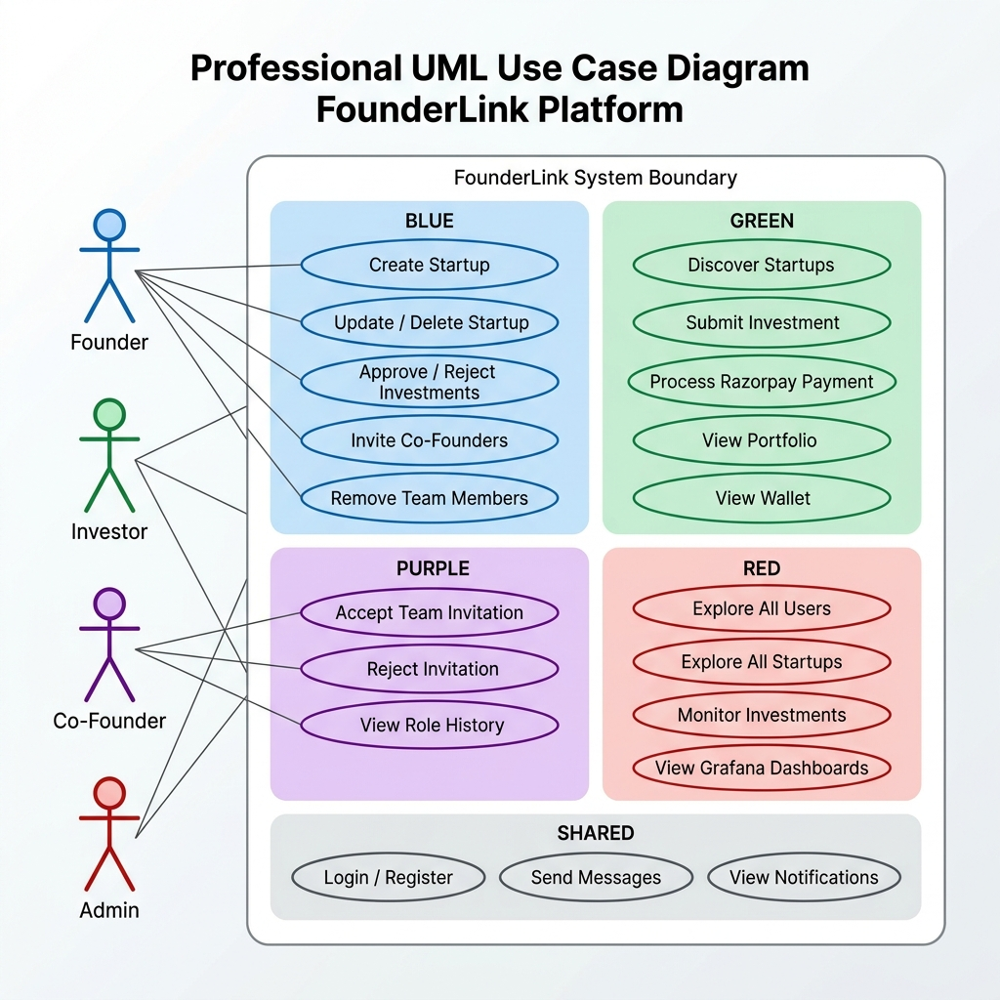

> **Roles**: Founder, Investor, Co-Founder, Admin — each with clearly scoped permissions within the platform boundary.


---

## High-Level Design (HLD)

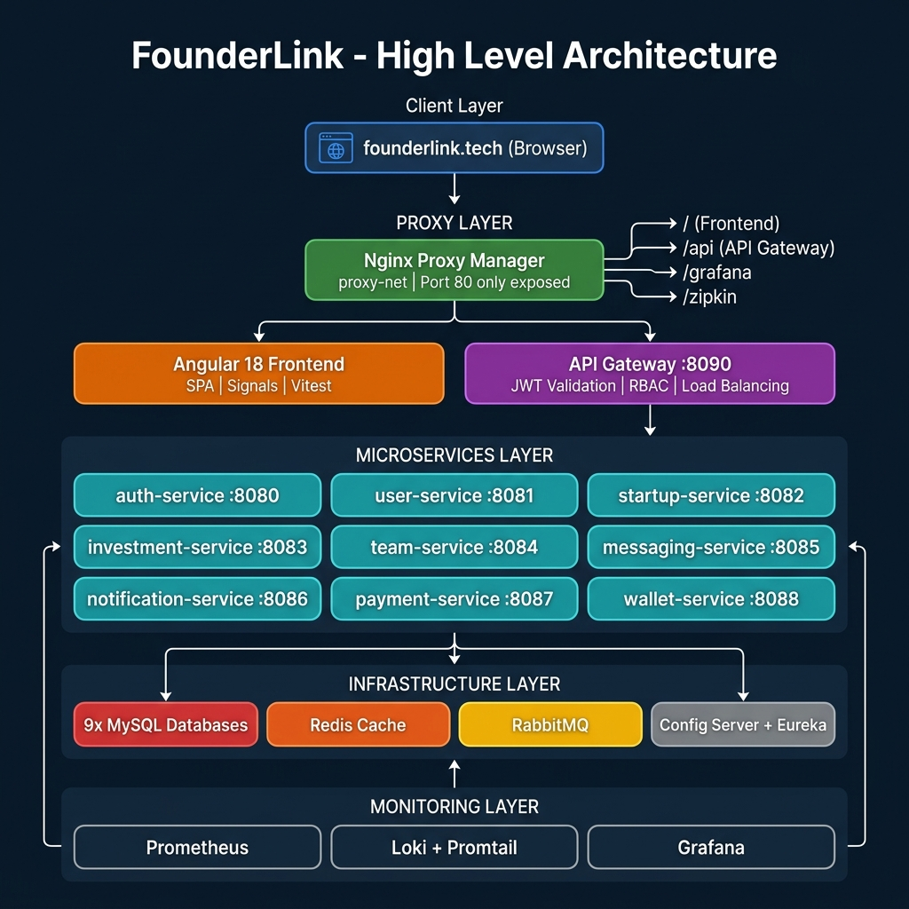

> All traffic enters through the Nginx Proxy Manager on **Port 80** only. The API Gateway handles JWT validation, RBAC, and load-balanced routing to the 9 microservices.

---

## Low-Level Design (LLD)

### LLD-1: Authentication Flow (JWT + Refresh Token Rotation)

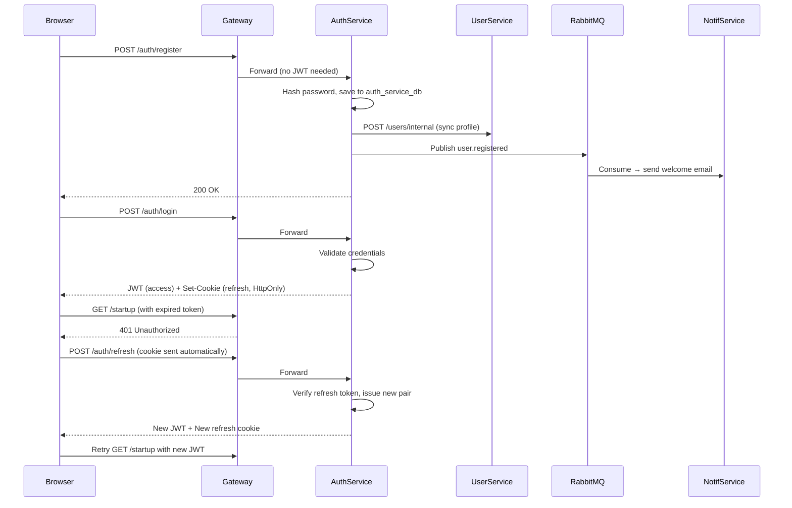

### LLD-2: Investment & Payment Saga

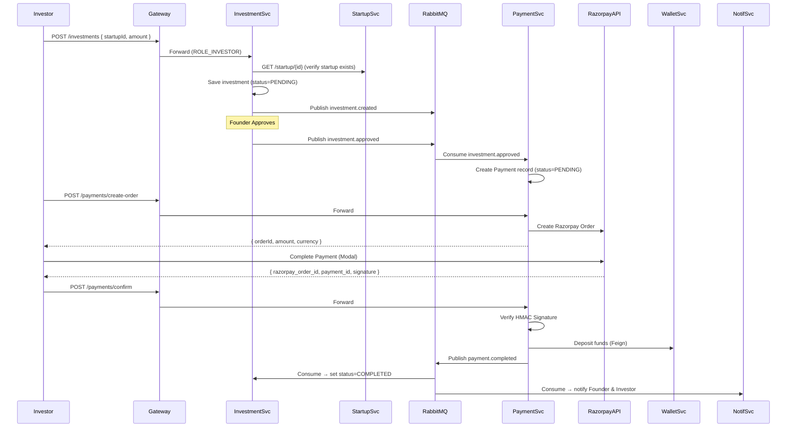

### LLD-3: Team Formation Flow

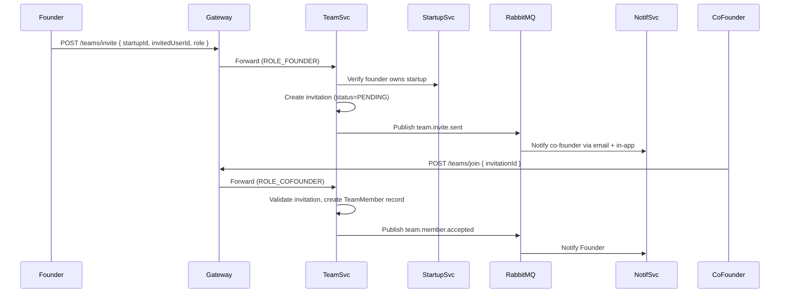

### LLD-4: Startup Deletion Cascade

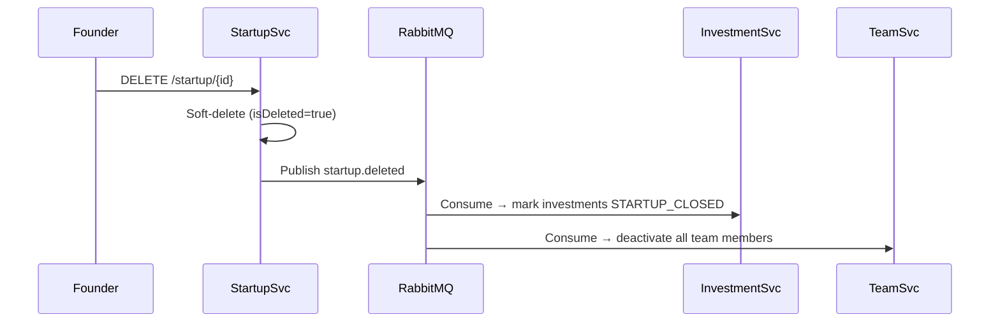

---

## Microservices Breakdown

| Service | Port | Database | Responsibilities |
|---|---|---|---|
| **api-gateway** | 8090 | — | JWT validation, RBAC, request routing, CORS, header injection |
| **auth-service** | 8080 | auth_service_db | Register, Login, JWT issuance, Refresh token rotation, Password reset |
| **user-service** | 8081 | user_db | Profile management, internal user sync |
| **startup-service** | 8082 | startup_db | Startup CRUD, discovery search, soft delete |
| **investment-service** | 8083 | investment_db | Investment creation, approval/rejection, payment reactions |
| **team-service** | 8084 | team_db | Invitations, join/reject/cancel, member management |
| **messaging-service** | 8085 | messaging_db | Direct messages, conversation history |
| **notification-service** | 8086 | notification_db | In-app notifications, SMTP emails |
| **payment-service** | 8087 | payment_db | Razorpay order creation, signature verification, wallet credit |
| **wallet-service** | 8088 | wallet_db | Wallet creation, fund deposits, balance lookup |
| **config-server** | 8888 | — | Centralized configuration from GitHub |
| **eureka-server** | 8761 | — | Service registry and load balancing |

### RBAC Rules (defined in API Gateway)

| Role | Key Permissions |
|---|---|
| **FOUNDER** | Create/update/delete startups, approve/reject investments, invite team members |
| **INVESTOR** | Browse startups, submit investments, create Razorpay orders, view portfolio & wallet |
| **COFOUNDER** | Accept/reject invitations, view team roles and history |
| **ADMIN** | Full read access across all services, can approve/reject investments |

---

## Async Communication Map

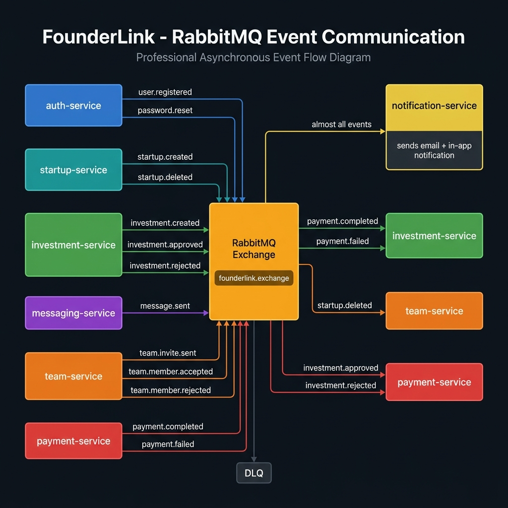

> All async events flow through the `founderlink.exchange` RabbitMQ exchange. A **Dead Letter Queue (DLQ)** is configured for payment events to ensure exactly-once processing.

---

## Frontend Architecture

The Angular 18 frontend is a **Single Page Application (SPA)** built with a modern reactive architecture using Signals.

### Application Bootstrap Flow

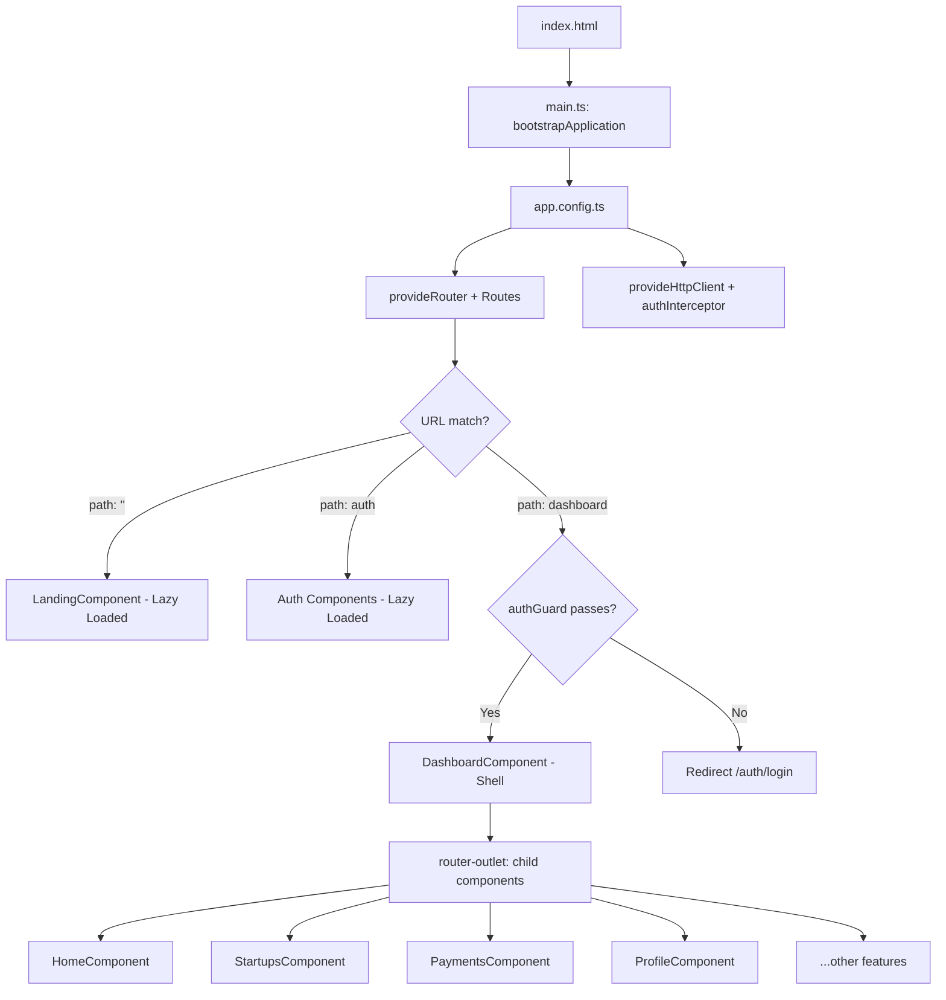

### Nested Router Outlet Architecture

```
app.html
└── <router-outlet>          ← Level 1 (Root)
    ├── LandingComponent     (path: '')
    ├── LoginComponent       (path: auth/login)
    └── DashboardComponent   (path: dashboard) ← Shell
        ├── <app-sidebar>    (permanent)
        ├── <app-navbar>     (permanent)
        └── <router-outlet>  ← Level 2 (Nested)
            ├── HomeComponent
            ├── StartupsComponent
            ├── PaymentsComponent
            └── ProfileComponent
```

### Key Angular Features Used

| Feature | Where | Purpose |
|---|---|---|
| **Signals (`signal`)** | `auth.service.ts`, `startups.ts` | Reactive state without `Observable` boilerplate |
| **Computed Signals** | `pagination.component.ts`, `auth.service.ts` | Derived state (`isLoggedIn`, `totalPages`) |
| **Effects** | `startups.ts` | Auto-trigger API calls when filter/page signals change |
| **Functional Guards** | `auth.guard.ts` | Protect `/dashboard` routes with `canActivate` |
| **Functional Interceptors** | `auth.interceptor.ts` | Auto-attach JWT + silent token refresh on 401 |
| **Lazy Loading** | `app.routes.ts` | Load page chunks only when navigated to |
| **Reactive Forms** | `login.ts`, `register.ts` | Form validation with `Validators.required`, `@Email` |
| **Smart/Dumb Pattern** | `startups.ts` + `pagination.component.ts` | Separation of data logic from presentation |

### Signal State Flow in `StartupsComponent`

```
User clicks "Page 2"
    ↓
onPageChange(2) called
    ↓
currentPage.set(2)        ← Writable Signal changes
    ↓
effect() wakes up         ← Detects signal change
    ↓
fetchFromBackend(page=2)  ← API call to backend
    ↓
Backend returns 12 items + totalElements: 36
    ↓
allStartups.set(data)     ← UI grid updates
totalElements.set(36)     ← Passed to <app-pagination>
    ↓
PaginationComponent       ← Computed: 36/12 = 3 pages
re-renders page buttons
```

### Auth Interceptor Flow

```
Every HTTP request
    ↓
authInterceptor intercepts
    ↓
Is it a public endpoint? (/auth/login, /auth/register)
    ├── YES → pass through unchanged
    └── NO  → clone request + add 'Authorization: Bearer <token>'
        ↓
    Backend responds
        ↓
    Is response 401 Unauthorized?
        ├── NO  → return response normally
        └── YES → call /auth/refresh silently
                → get new JWT
                → retry original request with new token
                → user sees nothing
```

---

## Deployment Architecture

### Network Topology

The VM exposes **only Port 80** to the internet. All routing is handled internally by **Nginx Proxy Manager**, which runs in a shared `proxy-net` Docker network.

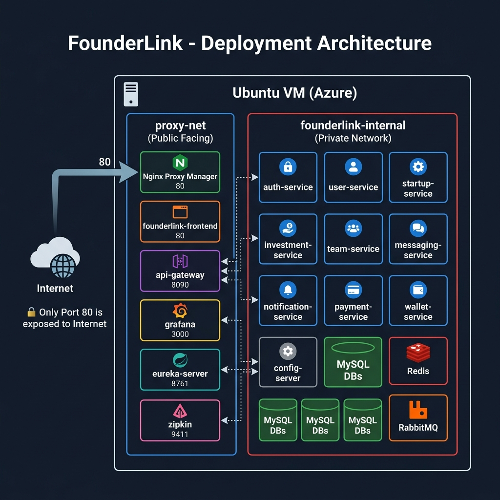

> **Security**: All 9 microservices and databases live exclusively on `founderlink-internal`. Zero direct internet access. The only public-facing services are those explicitly in `proxy-net`.

### Docker Compose Structure

The deployment is split into **3 compose files** for separation of concerns:

| File | Contains |
|---|---|
| `docker-compose.infra.yml` | 9 MySQL DBs, Redis, RabbitMQ, Eureka, Config Server, Zipkin |
| `docker-compose.services.yml` | 9 business microservices + API Gateway + Angular Frontend |
| `docker-compose.monitoring.yml` | Loki, Promtail, Prometheus, Grafana |

### Network Strategy

| Network | Type | Members |
|---|---|---|
| `proxy-net` | External (managed by Nginx Proxy Manager) | Frontend, API Gateway, Grafana, Eureka, Zipkin, Prometheus |
| `founderlink-internal` | Internal (Docker bridge) | **All** services + databases + brokers |

> **Security Design**: All microservices on `founderlink-internal` are completely invisible to the internet. The only publicly accessible containers are those explicitly attached to `proxy-net`.

---

## CI/CD Pipeline

The Jenkins pipeline is **commit-diff-driven** — it only builds and deploys services that have actually changed.

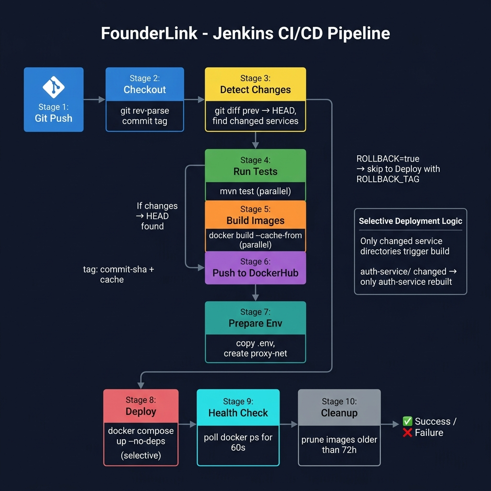

### Pipeline Stages

| Stage | Description |
|---|---|
| **Checkout** | Clones repo, determines `COMMIT_TAG` from `git rev-parse --short HEAD` |
| **Detect Changes** | Compares current vs previous commit to find which service dirs changed |
| **Run Tests** | Runs `mvn test` in parallel for all changed services |
| **Build Images** | Docker build with layer caching (`--cache-from`) in parallel |
| **Push Images** | Pushes `commit-tag` + `cache` image to DockerHub |
| **Prepare Environment** | Copies `.env` from Jenkins credentials, creates `proxy-net` |
| **Deploy Infra** | Selective `docker compose up --no-deps` for infra services |
| **Deploy Services** | Selective `docker compose up --no-deps` for app services |
| **Restart Config** | Restarts config-server if `config-repo/` files changed |
| **Health Check** | Polls `docker ps` for all deployed containers for up to 60 seconds |
| **Cleanup** | Prunes Docker images older than 72 hours |

### Rollback Strategy
- Set pipeline parameter `ROLLBACK=true` and `ROLLBACK_TAG=<short-commit-sha>`
- Pipeline skips all build stages and directly deploys all services using the target tag

---

## Monitoring & Observability

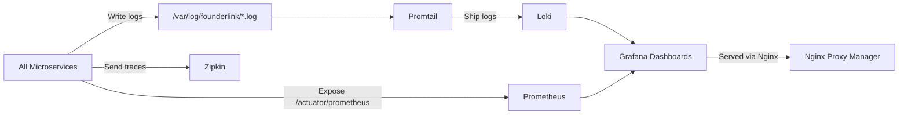

| Tool | Purpose | Access |
|---|---|---|
| **Prometheus** | Scrapes metrics from all Spring Boot Actuator endpoints | `proxy-net` via NPM |
| **Loki** | Aggregates structured log files from all services | Internal only |
| **Promtail** | Ships log files from the shared `service-logs` volume to Loki | Internal only |
| **Grafana** | Unified dashboard for logs, metrics, and alerts | `grafana.founderlink.tech` |
| **Zipkin** | Distributed request tracing across microservices | `zipkin.founderlink.tech` |

---

## Environment Configuration

Managed via a **root `.env` file** (never committed) and a **centralized `config-repo/`** hosted on GitHub and served by the Config Server.

### Key Environment Variables

| Variable | Used By | Purpose |
|---|---|---|
| `JWT_SECRET` | api-gateway, auth-service | Shared HS256 secret for JWT signing/verification |
| `INTERNAL_SECRET` | auth-service → user-service | Protects internal service-to-service calls |
| `RAZORPAY_KEY_ID` | payment-service, frontend | Razorpay public key |
| `RAZORPAY_KEY_SECRET` | payment-service | Razorpay HMAC verification secret |
| `MAIL_USERNAME / MAIL_PASSWORD` | notification-service | SMTP credentials for email dispatch |
| `DB_USERNAME / DB_PASSWORD` | All services | Shared MySQL credentials |
| `RABBITMQ_USERNAME / RABBITMQ_PASSWORD` | All services | RabbitMQ broker credentials |
| `GRAFANA_ADMIN_USER / PASSWORD` | grafana | Grafana admin login |

---

## Getting Started Locally

### Prerequisites
- Docker Desktop
- Java 21
- Node.js 20+
- Jenkins (for CI/CD)

### Quick Start

```bash
# 1. Clone the repository
git clone https://github.com/aditya-7562/FounderLink.git
cd FounderLink

# 2. Copy and fill in environment variables
cp .env.example .env
# Edit .env with your credentials

# 3. Create the shared proxy network
docker network create proxy-net

# 4. Start infrastructure (databases, Redis, RabbitMQ, Eureka, Config Server)
docker compose -f docker-compose.infra.yml up -d

# 5. Start all business services
docker compose -f docker-compose.services.yml up -d

# 6. Start monitoring stack
docker compose -f docker-compose.monitoring.yml up -d

# 7. Run the frontend locally
cd founderlink-frontend
npm install
npm start
# Visit http://localhost:4200
```

### Service Endpoints (Local)

| Service | URL |
|---|---|
| **Frontend** | `http://localhost:4200` |
| **API Gateway / Swagger** | `http://localhost:8090/swagger-ui.html` |
| **Eureka Dashboard** | `http://localhost:8761` |
| **RabbitMQ Management** | `http://localhost:15672` |
| **Grafana** | `http://localhost:3000` |
| **Zipkin** | `http://localhost:9411` |

---

## Project Structure

```
FounderLink/
├── api-gateway/               # Spring Cloud Gateway + JWT/RBAC filter
├── auth-service/              # Authentication + token management
├── user-service/              # User profile store
├── Startup-Service/           # Startup CRUD + discovery
├── investment-service/        # Investment lifecycle
├── team-service/              # Team invitations + membership
├── messaging-service/         # Direct messaging
├── notification-service/      # In-app + email notifications
├── payment-service/           # Razorpay integration + wallet credit
├── wallet-service/            # Startup wallet management
├── Config-Server/             # Spring Cloud Config Server
├── Service-Registry/          # Netflix Eureka Server
├── config-repo/               # Centralized YAML configs per service
├── founderlink-frontend/      # Angular 18 SPA
├── docker-compose.infra.yml   # Infrastructure services
├── docker-compose.services.yml # Application services
├── docker-compose.monitoring.yml # Observability stack
├── Jenkinsfile                # CI/CD pipeline
├── prometheus.yml             # Prometheus scrape config
├── promtail-config.yml        # Log shipping config
└── .env                       # Secret environment variables (not committed)
```

---

*Built with ❤️ by the FounderLink Team*
